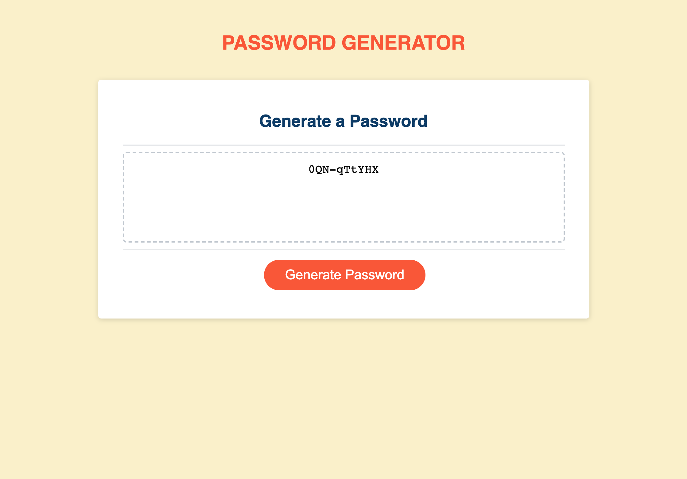

# Password Generator

## Description

Week 05: Challenge 05 – Password Generator
Using starter code supplied by edX Bootcamp, I have created various Javascript functions to allow a user to click a button and generate a password with their desired inputs (e.g. length).

## Installation

N/A

View the web application at: https://zwirled.github.io/password-generator/

## Usage

To use this web application, click the button "Generate Password", there you will be prompted with various questions regarding the kind of password you require. Once you have customised the password required, it will output within the textarea field.

## Credits

edX Bootcamp

## License

MIT License

Copyright (c) [2023] [Amelia Bramwell]

Permission is hereby granted, free of charge, to any person obtaining a copy of this software and associated documentation files (the "Software"), to deal in the Software without restriction, including without limitation the rights to use, copy, modify, merge, publish, distribute, sublicense, and/or sell copies of the Software, and to permit persons to whom the Software is furnished to do so, subject to the following conditions:

The above copyright notice and this permission notice shall be included in all copies or substantial portions of the Software.

THE SOFTWARE IS PROVIDED "AS IS", WITHOUT WARRANTY OF ANY KIND, EXPRESS OR IMPLIED, INCLUDING BUT NOT LIMITED TO THE WARRANTIES OF MERCHANTABILITY, FITNESS FOR A PARTICULAR PURPOSE AND NONINFRINGEMENT. IN NO EVENT SHALL THE AUTHORS OR COPYRIGHT HOLDERS BE LIABLE FOR ANY CLAIM, DAMAGES OR OTHER LIABILITY, WHETHER IN AN ACTION OF CONTRACT, TORT OR OTHERWISE, ARISING FROM, OUT OF OR IN CONNECTION WITH THE SOFTWARE OR THE USE OR OTHER DEALINGS IN THE SOFTWARE.
